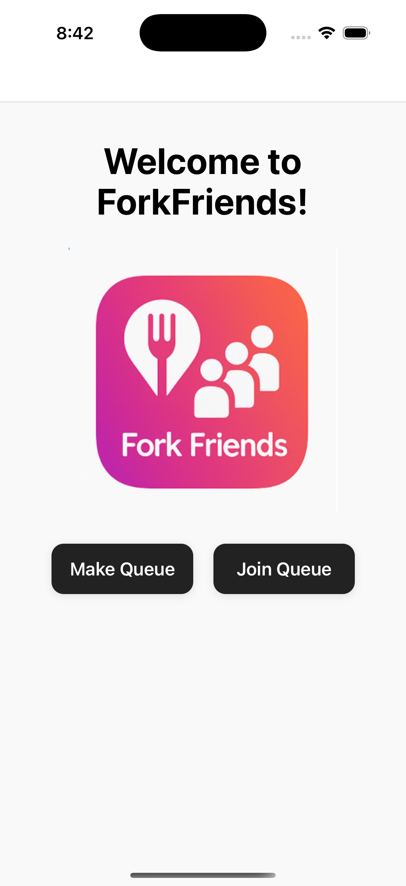
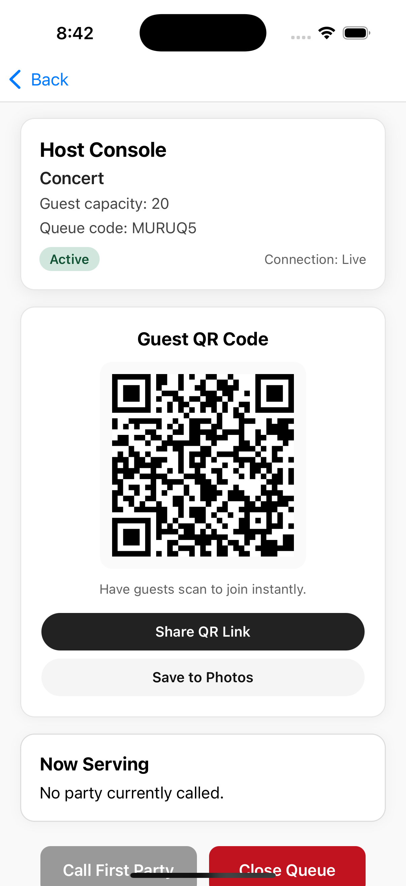
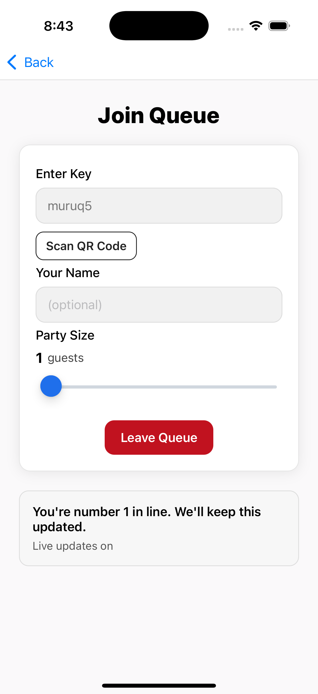
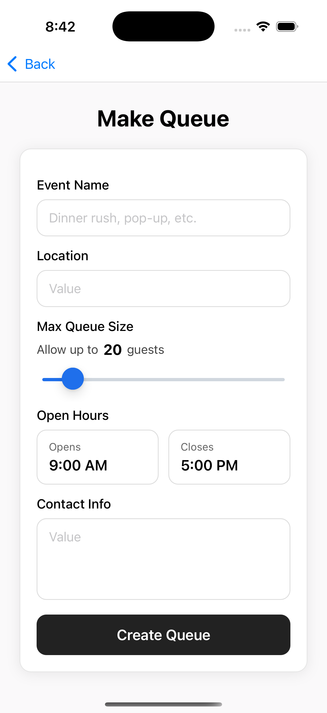

# QueueUp

QueueUp is a real-time queueing companion for pop-up events, meet-and-greets, and walk-in experiences. Hosts spin up a queue in seconds, guests join with a scan or short code, and everyone gets live updates as the line moves.

## What Makes QueueUp Useful
- Live queue state is powered by Cloudflare Durable Objects, so everyone sees the same order instantly.
- Hosts control capacity, advance parties, and close the queue from a dedicated console.
- Guests join from the mobile app or web and receive their place in line immediately.
- Built with Expo + React Native, so the same codebase runs on iOS, Android, and the web.

## How QueueUp Flows
1. Create a queue from the Make Queue screen, set an event name, and share the automatically generated join link or QR code.
2. Guests open the app, select Join Queue, and scan the QR code or enter the short code to secure their spot.
3. Hosts watch the queue update in real time, advance or remove parties, and close things out once the event wraps.

## Screenshots
| Home | Host Console |
| --- | --- |
|  |  |

| Join Queue | Make Queue |
| --- | --- |
|  |  |

## Getting Started
- **Prerequisites:** Node.js 20+, npm, and an iOS/Android emulator or physical device if you plan to run the mobile client. A free Cloudflare account is required for the backend.
- **Install dependencies:** `npm install`
- **Run the Expo app:** `npm run start` (then pick your platform in the Expo CLI). Use `npm run ios` or `npm run android` for direct simulator/emulator launches.
- **Configure the API base URL:** Set `EXPO_PUBLIC_API_BASE_URL` in `.env` (or your shell) to your deployed Worker origin, e.g.\
  `EXPO_PUBLIC_API_BASE_URL=https://queueup-api.example.workers.dev`\
  When unset, the app points at `http://localhost:8787` (`127.0.0.1` on iOS simulators, `10.0.2.2` on Android emulators) to match Wrangler's dev tunnel.
## change
## Backend Setup
The Cloudflare Worker that powers QueueUp lives in `api/`. Follow the step-by-step backend guide in [docs/BACKEND-QUICKSTART.md](docs/BACKEND-QUICKSTART.md) to provision D1, KV, secrets, and run migrations.

## Testing
Run the Vitest suite—backed by `@cloudflare/vitest-pool-workers`—with:

```sh
npm run test
```

Use `npm run test:watch` for faster feedback while iterating.

## Learn More
- Architecture deep dive: `docs/ARCHITECTURE.md`
- API contract: `docs/API.md`
- Deploying the web front end: `.github/workflows/deploy-gh-pages.yml`
